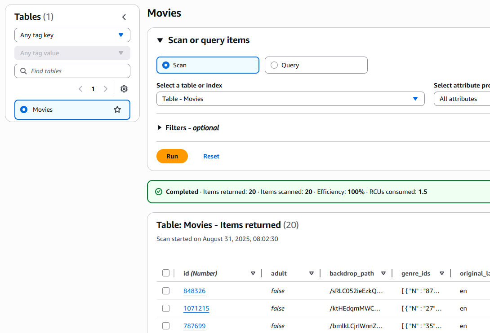
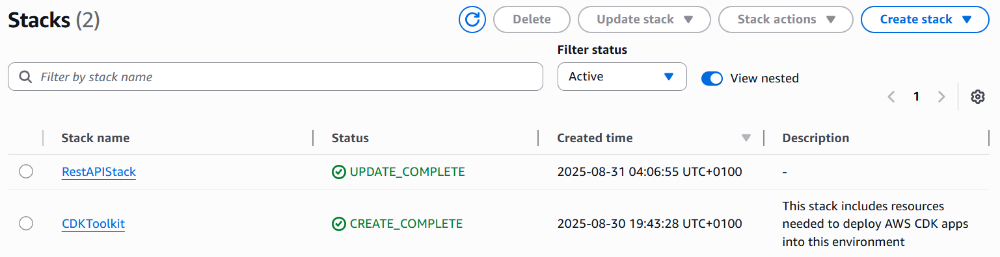
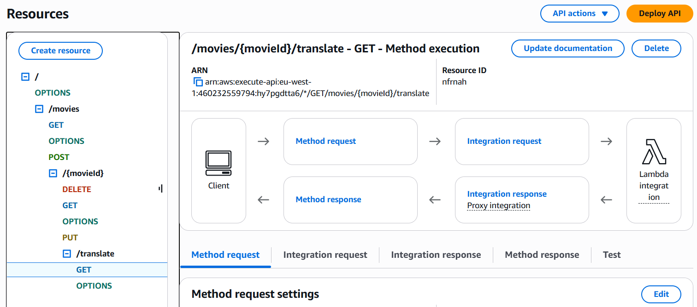

# Serverless REST Assignment 1 - Disributed Systems

Name: Daniel Keane

Demo: https://www.youtube.com/watch?v=sRcf_EA49YM

## Useful commands

* `npm run build`   compile typescript to js
* `npm run watch`   watch for changes and compile
* `npm run test`    perform the jest unit tests
* `cdk deploy`      deploy this stack to your default AWS account/region
* `cdk diff`        compare deployed stack with current state
* `cdk synth`       emits the synthesized CloudFormation template

## Context

For this assignment I chose to use movie data for my API. This API is designed to create, store, and manage movie information. It contains info such as 

* id - The unique identifier for each movie
* original_title - The official name of the movie
* overview - A brief description of the movie
* release_date - the date the movie was released

and more!!!

## App API Endpoints

[ Provide a bullet-point list of the app's endpoints (excluding the Auth API) you have successfully implemented. ] e.g.

* GET /movies - Gets all movies
* GET /movies/(id) - Gets the movie based on the provided ID
* POST /movies - Add a new movie
* DELETE /movies/(id) - Delete a movie based on the provided ID
* PUT /movies/(id) - Update parameters of a movie based on the provided ID
* GET /movies/(id)/translate?language=(value) - Takes the overview text of a movie and translates it to the chosen language, then return the full movie details with the translation. 

## Translation 

The lambda function used to translate text for this assignment utilises AWS Translate to translate the overview(description) of the movie chosen to a specified language. The function uses a GET request to fetch the movie info from DynamoDB which it then translate and returns the full movie details with the translation included. 

## Auth API Endpoints
Auth API Endpoints was not attempted for this assignment

## Relevant Images

Heres my DynamoDB showing the movies table and the movies in it

Heres my CloudFormation showing the stacks created by the project

Heres my API Gateway showing the endpoints for the project

## Sources

For the translation feature I used the official Amazon Translate documentation to aid me in implementation and understanding while I worked on the feature

https://docs.aws.amazon.com/translate/latest/dg/what-is.html